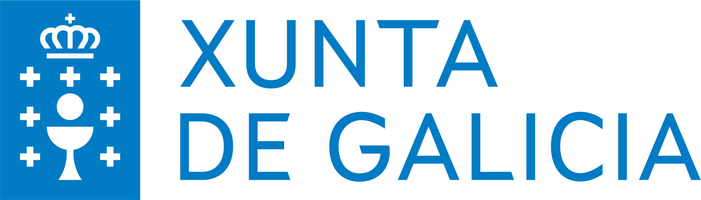

# Retos de ciberseguridade

Benvido/a ó repositorio do proxecto _‘Plataforma de retos de ciberseguridade. A gamificación no proceso de adquisición de competencias no ámbito da ciberseguridade’_ que resultou premiado na Resolución do 23 de marzo de 2021 da Secretaría Xeral de Educación e Formación Profesional pola que se resolven os premios para o desenvolvemento de proxectos de innovación tecnolóxica ou científica e proxectos de innovación didáctica no ámbito da Formación Profesional. 

Empresas e organismos como exércitos, forzas e corpos de seguridade do estado; confían en eventos como os Cyber Ranges e os retos CTF (Capture The Flag), tanto na modalidade Attack-Defense coma Jeopardy, como parte do proceso de aprendizaxe, actualización e adestramento no ámbito da ciberseguridade dos seus membros. Este repositorio contén retos CTF sobre diversas temáticas como análise forense e hacking ético, empregados para mellorar a docencia de ciberseguridade en ciclos e cursos de especialización de Formación Profesional.

Repositorio de retos CTFs listos para montar na plataforma [ctfd](https://github.com/CTFd/CTFd). Os retos están clasificados por carpetas, onde atoparás:
- backup_xxxx.zip --> copia de seguridade lista para ser importada en [ctfd](https://github.com/CTFd/CTFd) (usuario: administrador / contrasinal: fpinnovagalicia2022 )
- xxxx.md --> información sobre o reto (temática, autor, ...)
- ctf_xxxx_preguntas_es.pdf --> preguntas do reto CTF en español
- ctf_xxxx_preguntas_gal.pdf --> preguntas do reto CTF en galego
- ctf_xxxx_solucion_es.pdf --> solucións do reto CTF en español
- ctf_xxxx_solucion_gal.pdf --> solucións do reto CTF en galego

---
 
<table align="center" cellspacing="50">
<tr>
   <td><h1 align=center><a href="https://www.iessanclemente.net/" target="_blank">IES San Clemente</a></h1></td>
   <td><h1 align=center><a href="https://www.cifprodolfoucha.es/"  target="_blank">CIFP Rodolfo Ucha Piñeiro</a></h1></td>
</tr>
<tr>
    <td></td>
    <td></td>
</tr>
</table>
      
 

      <h6>Actividade desenvolvida dentro do proxecto "Plataforma de retos de ciberseguridade. A gamificación no proceso de adquisición de competencias no ámbito da ciberseguridade", financiado na convocatoria de premios para o desenvolvemento de proxectos de innovación na FP do ano 2022.</h6>
