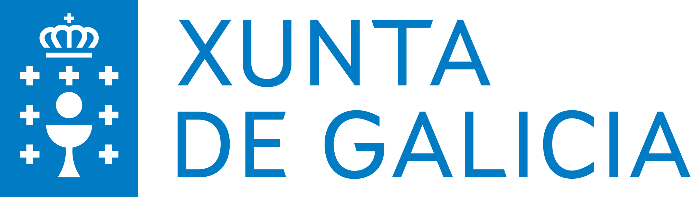
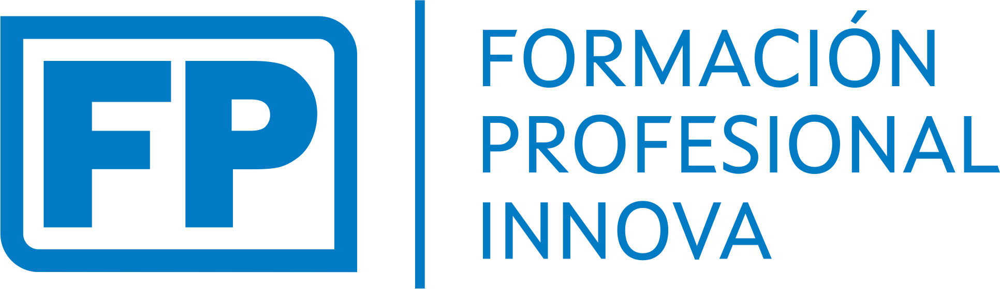

## Log4Shell

#### Temática: malware para Windows / exfiltración de información
#### Nº preguntas: 26
#### Duración estimada: 4 horas
#### Autor: [Manuel González Regal](https://twitter.com/ManuelGRegal)
#### Ficheros:
- [caso.md](caso.md): ambientación
- [ctf_hawkeye_preguntas_gal.pdf](): preguntas en galego
- [ctf_hawkeye_preguntas_es.pdf](): preguntas en español
- [ctf_hawkeye_solucion_gal.pdf](): respostas en galego
- [ctf_hawkeye_solucion_es.pdf](): respuestas en español
- [backup_hawkeye.zip](): para importar en plataforma [ctfd](https://github.com/CTFd/CTFd) (usuario: administrador / contrasinal: fpinnovagalicia2022 )
 
 
---
 
<table align="center" cellspacing="50">
<tr>
   <td><h1 align=center><a href="https://www.iessanclemente.net/" target="_blank">IES San Clemente</a></h1></td>
   <td><h1 align=center><a href="https://www.cifprodolfoucha.es/"  target="_blank">CIFP Rodolfo Ucha Piñeiro</a></h1></td>
</tr>
<tr>
    <td></td>
    <td></td>
</tr>
</table>
      
 

      <h6>Actividade desenvolvida dentro do proxecto "Plataforma de retos de ciberseguridade. A gamificación no proceso de adquisición de competencias no ámbito da ciberseguridade", financiado na convocatoria de premios para o desenvolvemento de proxectos de innovación na FP do ano 2022.</h6>

